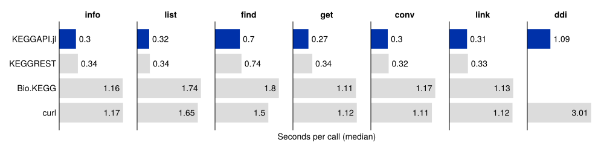

[](https://cvigilv.github.io/KEGGAPI.jl/stable/)
[](https://cvigilv.github.io/KEGGAPI.jl/dev/)
[](https://github.com/cvigilv/KEGGAPI.jl/actions/workflows/CI.yml?query=branch%3Amain)
[](https://codecov.io/gh/cvigilv/KEGGAPI.jl)
[](https://github.com/fredrikekre/Runic.jl)


KEGGAPI.jl is a Julia package for accesing the Kyoto Encyclopedia of Genes and Genomes, striving to take advantage of the speed and flexibility that Julia offers and make it accessible to the bioinformatics and functional annotation communities.

## Installation

```julia
pkg> add https://github.com/cvigilv/KEGGAPI.jl
```

## Usage

The package wraps the [KEGG REST API](https://www.kegg.jp/kegg/rest/keggapi.html)
operations:

| Function     | KEGG operation | Purpose                                          |
|:-------------|:---------------|:-------------------------------------------------|
| `kegg_info`  | `info`         | Database release information and statistics       |
| `kegg_list`  | `list`         | Entry identifiers and associated names            |
| `kegg_find`  | `find`         | Search entries by keyword or chemical data        |
| `kegg_get`   | `get`          | Retrieve entries, sequences, images, KGML, JSON   |
| `kegg_conv`  | `conv`         | Convert between KEGG and outside identifiers      |
| `kegg_link`  | `link`         | Find related entries via cross-references         |
| `kegg_ddi`   | `ddi`          | Adverse drug-drug interactions                    |

```julia
using KEGGAPI

result = kegg_find("compound", "glucose")
result.colnames    # column names
result.data        # retrieved data
```

## Documentation

- [Getting started](https://cvigilv.github.io/KEGGAPI.jl/dev/man/getting-started/)
- [Examples](https://cvigilv.github.io/KEGGAPI.jl/dev/man/examples/)
- [API reference](https://cvigilv.github.io/KEGGAPI.jl/dev/man/api/)

Worked end-to-end use cases:

- [Case 1: From a UniProt ID to KEGG information](https://cvigilv.github.io/KEGGAPI.jl/dev/man/usecases/case1/)
- [Case 2: EC reaction information in KEGG](https://cvigilv.github.io/KEGGAPI.jl/dev/man/usecases/case2/)
- [Case 3: Identifying a compound in KEGG](https://cvigilv.github.io/KEGGAPI.jl/dev/man/usecases/case3/)
- [Case 4: Target molecule information at KEGG](https://cvigilv.github.io/KEGGAPI.jl/dev/man/usecases/case4/)

## Speed Tests



See [`benchmarking/`](benchmarking/README.md) for how to reproduce these numbers.

## Citation

_publication pending_
